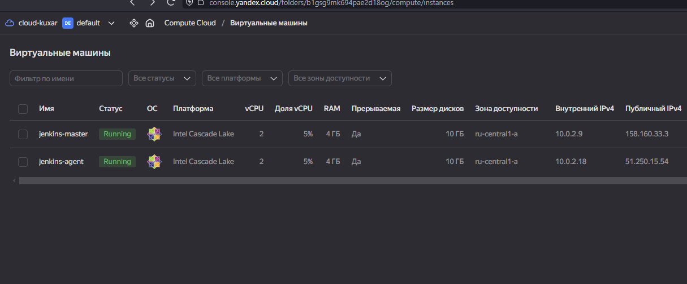
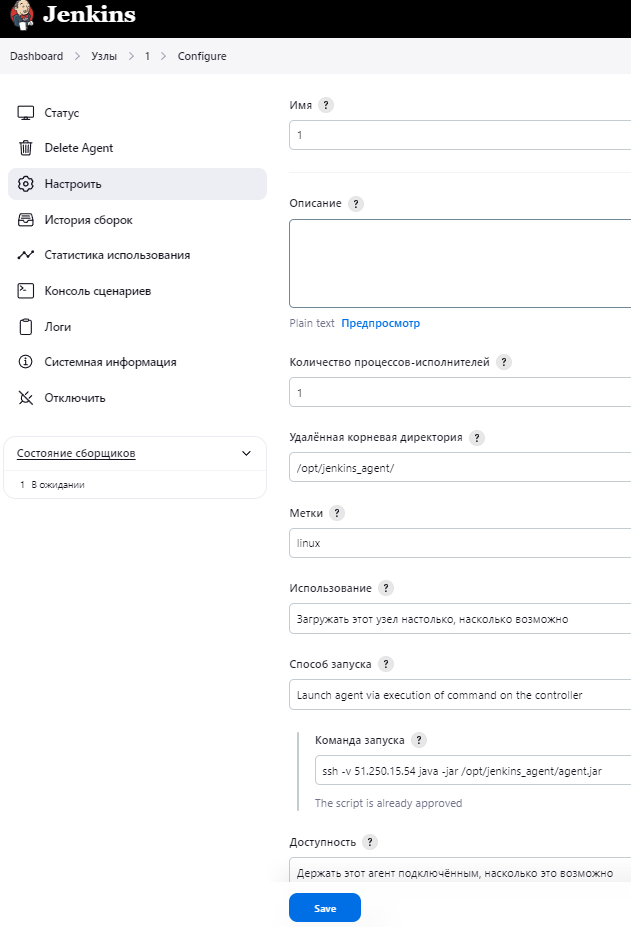
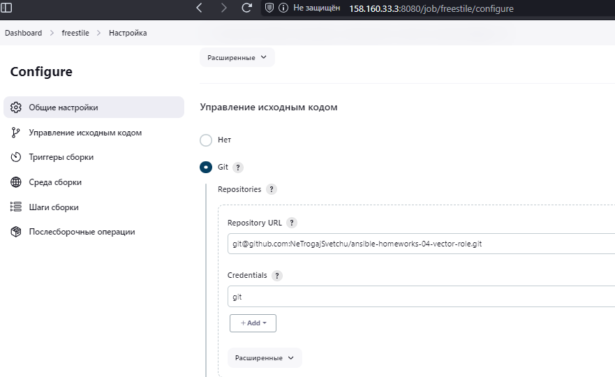
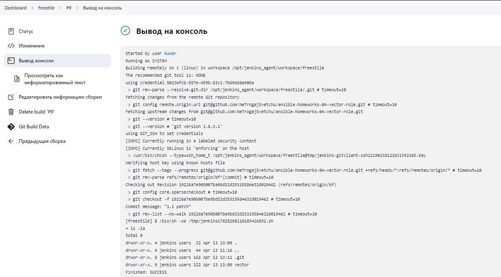
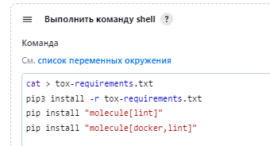
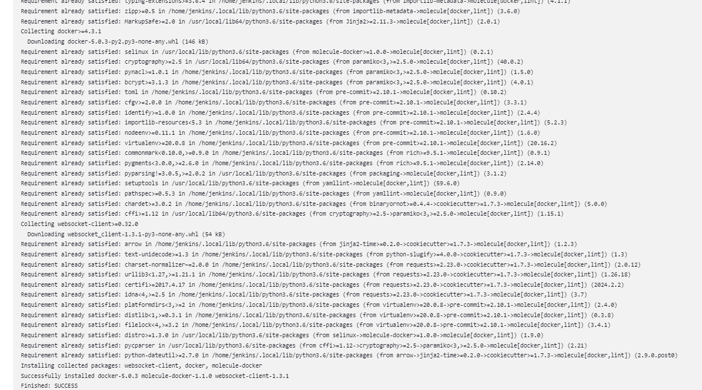
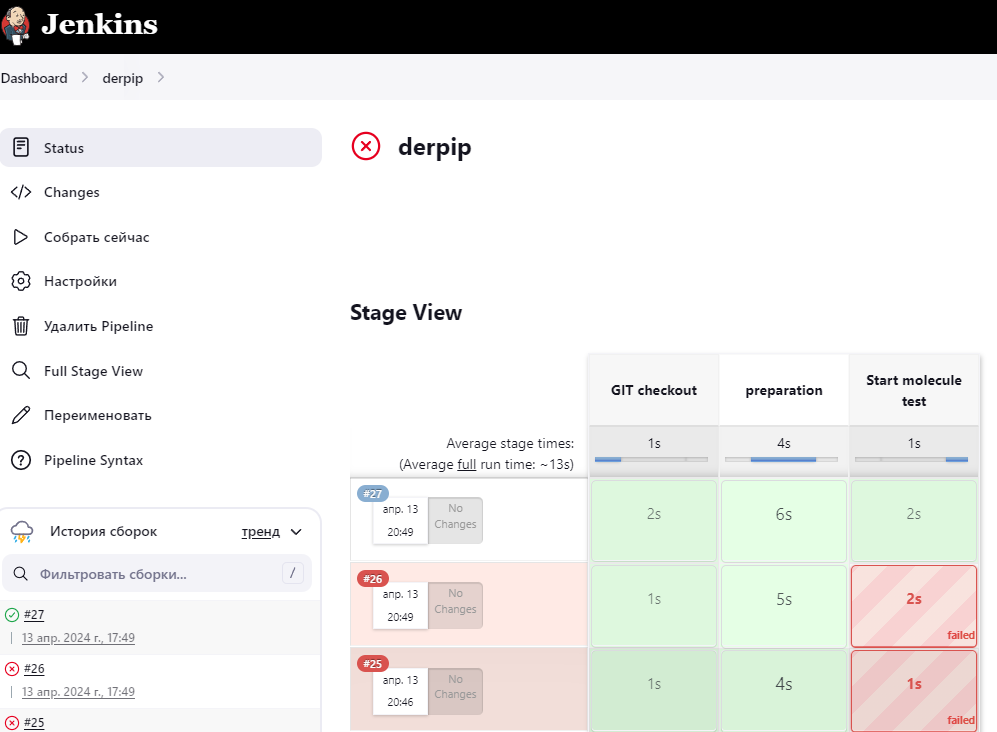
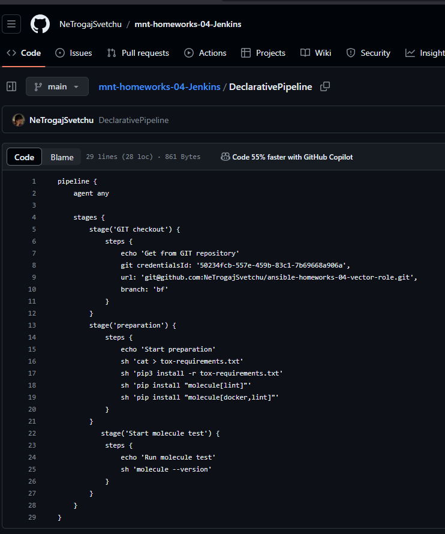

успешно установил при помощи тераформ и установил ПО

докачал модуль command-launcher и подключил агента

подключился к git настроив ssh ключи

1.выполнен код"Собрать сейчас"

2.
pipeline {
    agent any

    stages {
        stage('GIT checkout') {
            steps {
                echo 'Get from GIT repository'
                git credentialsId: '50234fcb-557e-459b-83c1-7b69668a906a',
                url: 'git@github.com:NeTrogajSvetchu/ansible-homeworks-04-vector-role.git',
                branch: 'bf'
            }
        }
        stage('preparation') {
            steps {
                echo 'Start preparation'
                sh 'cat > tox-requirements.txt'
                sh 'pip3 install -r tox-requirements.txt'
                sh 'pip install "molecule[lint]"'
                sh 'pip install "molecule[docker,lint]"'
            }
        }
           stage('Start molecule test') {
            steps {
                echo 'Run molecule test'
                sh 'molecule --version'
            }
        }
    }
}

3.
