успешно установил при помощи тераформ и установил ПО

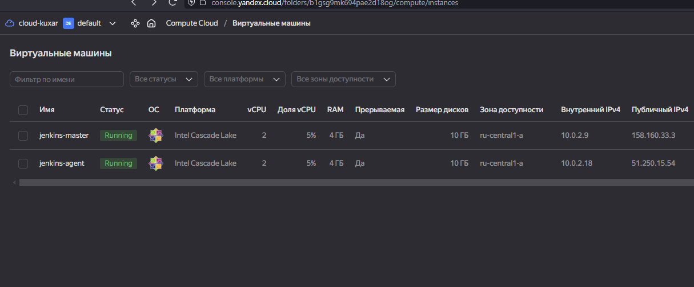

Докачал модуль command-launcher и подключил агента


подключился к git настроив ssh ключи

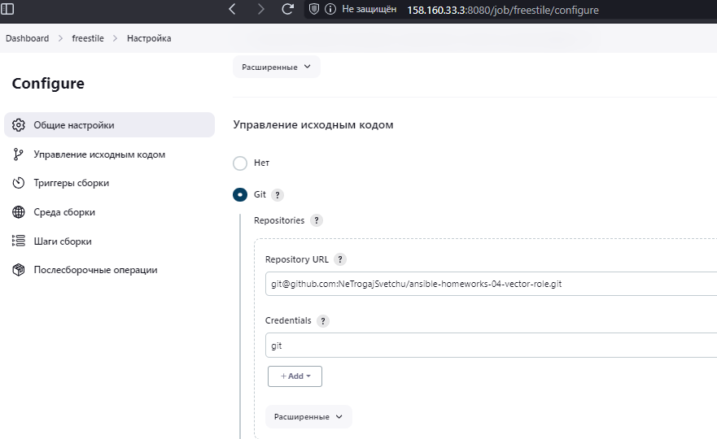

1.выполнен код"Собрать сейчас"
Ранее я не проходи еще курс ансибл по молекуле

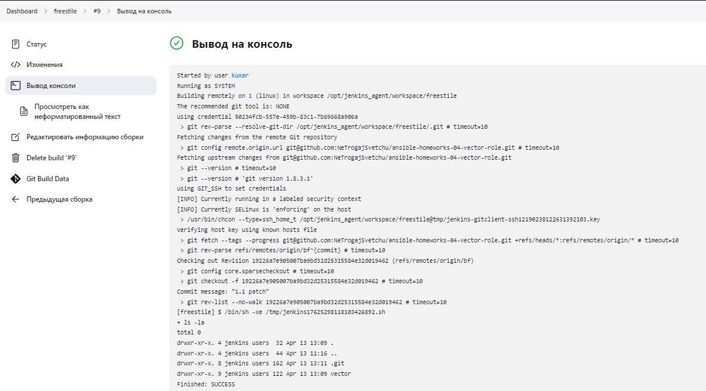

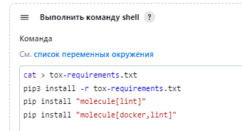

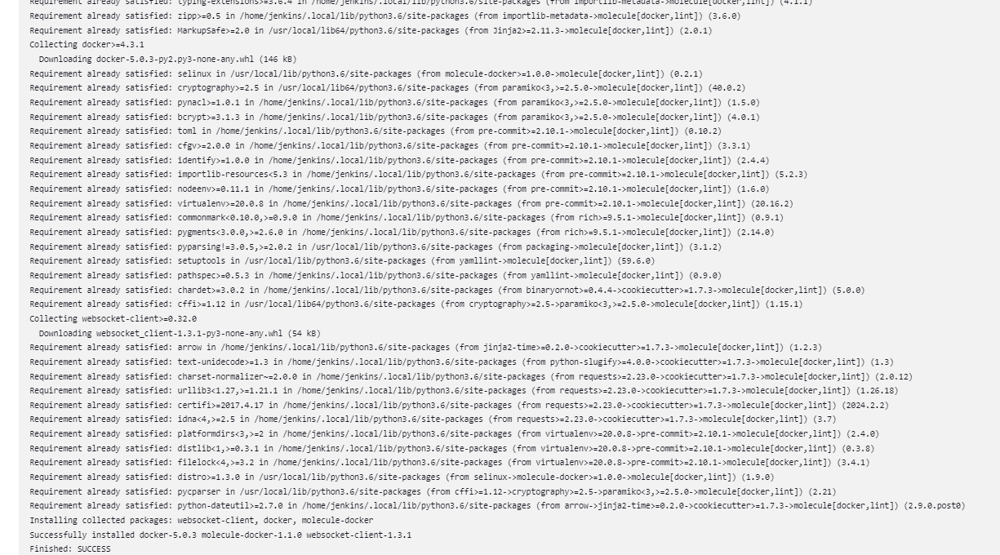

2.Declarative Pipeline

  ```Groovy
    pipeline {
    agent any

    stages {
        stage('GIT checkout') {
            steps {
                echo 'Get from GIT repository'
                git credentialsId: '50234fcb-557e-459b-83c1-7b69668a906a',
                url: 'git@github.com:NeTrogajSvetchu/ansible-homeworks-04-vector-role.git',
                branch: 'bf'
            }
        }
        stage('preparation') {
            steps {
                echo 'Start preparation'
                sh 'cat > tox-requirements.txt'
                sh 'pip3 install -r tox-requirements.txt'
                sh 'pip install "molecule[lint]"'
                sh 'pip install "molecule[docker,lint]"'
            }
        }
           stage('Start molecule test') {
            steps {
                echo 'Run molecule test'
                sh 'molecule --version'
            }
        }
    }
    }
```
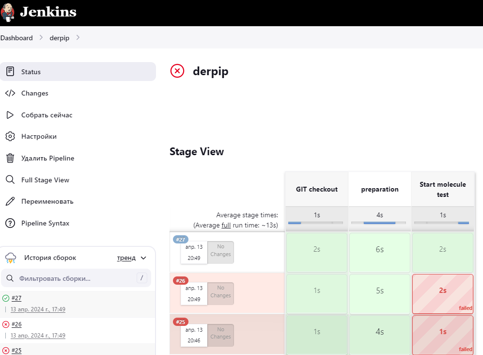

3.Перенести Declarative Pipeline в репозиторий в файл Jenkinsfile.

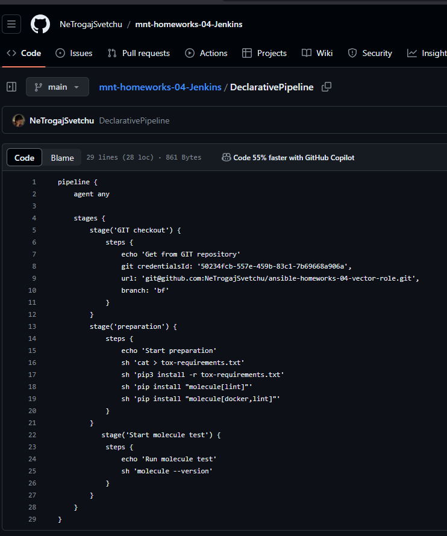

4.Создать Multibranch Pipeline на запуск Jenkinsfile из репозитория.

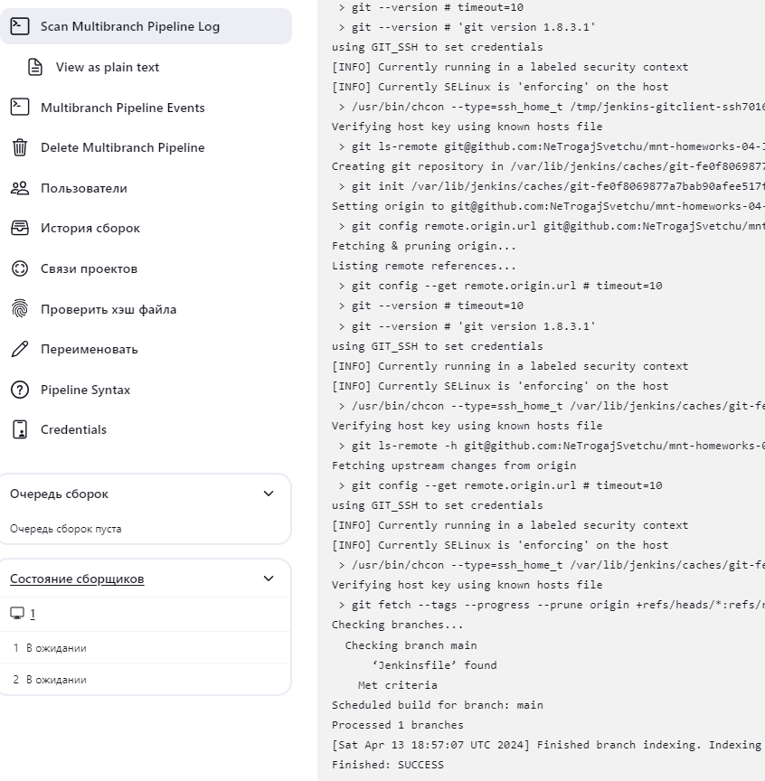

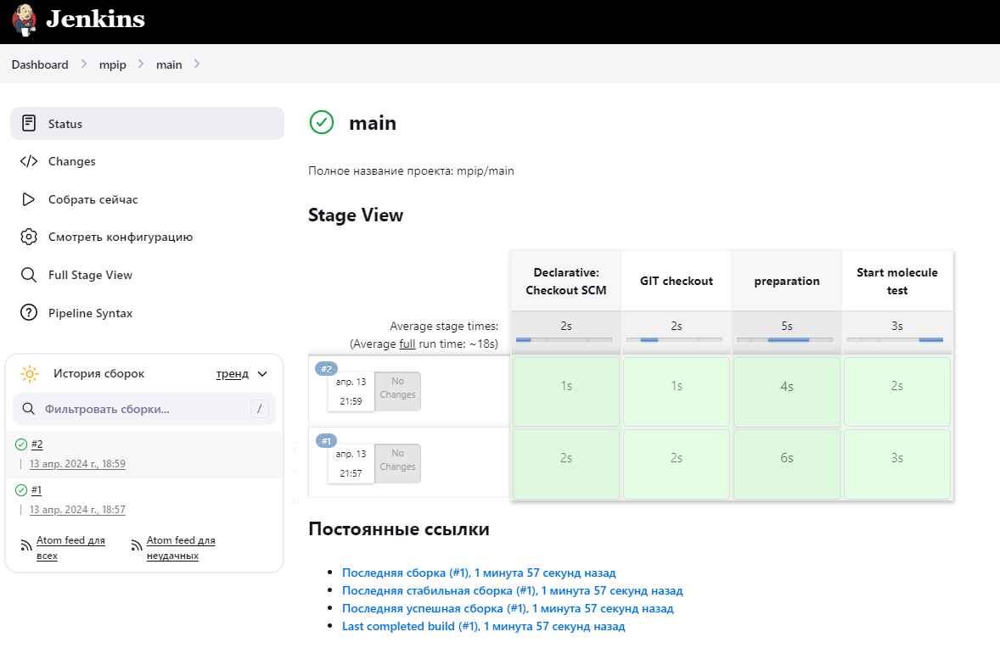

5.Scripted Pipeline

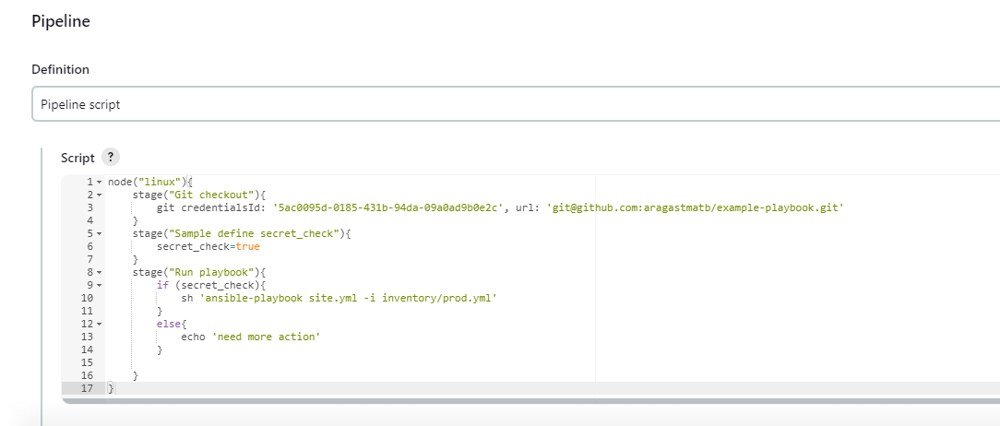

6. Scripted Pipeline
7. 
На центосе 7 провозился очень долго ни какие методы не помогали исправить ошибку при инициализации плейбука, выдавало ошибку о не хватки прав. Помогло решение с установкой центоса 8

TASK [java : Ensure installation dir exists] ***********************************
fatal: [localhost]: FAILED! => {"changed": false, "module_stderr": "sudo: a password is required\n", "module_stdout": "", "msg": "MODULE FAILURE\nSee stdout/stderr for the exact error", "rc": 1}

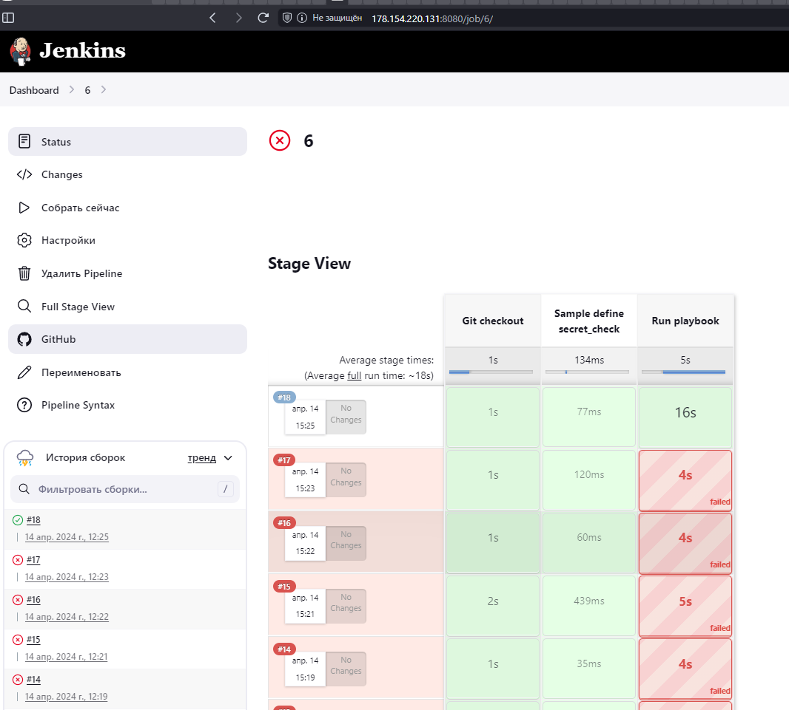


7. 2
   ```Groovy
   Scripted Pipeline
   node("linux"){
    stage("Git checkout"){
        git credentialsId: '8644fb7b-d4b2-4972-a08c-722bbd0c098f', url: 'git@github.com:aragastmatb/example-playbook.git'
    }
    stage("Sample define secret_check"){
        secret_check=true
    }
    stage("Run playbook"){
        if (secret_check){
            sh 'ansible-playbook site.yml  -i inventory/prod.yml --ask-become-pass '
        }
        else{
            sh 'ansible-playbook site.yml  -i inventory/prod.yml -vvv --ask-become-pass --check --diff'
        }}}

   ```